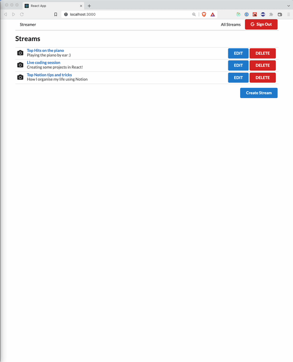

<div id="top"></div>

<br />
<div align="center">

<h3 align="center">CRUD Streaming App with React and Redux</h3>

</div>


<div align="center">

</div>

## About the Project

CRUD Streaming App with React and Redux. The app allows a user to view a list of available streams or to create, edit, or delete his own streams.

<p align="right">(<a href="#top">back to top</a>)</p>

### Built With

- [React](https://reactjs.org/) (React router, Portals);
- [Redux](https://redux.js.org/) for managing state;
- [Google Auth](https://developers.google.com/identity/protocols/oauth2/javascript-implicit-flow) for client-side authentication;
- [SemanticUI](https://semantic-ui.com/) for styling;
- [JSON API](https://jsonapi.org/) for spinning up a simple API;
- [OBS Studio](https://obsproject.com/) to connect to a stream.

<p align="right">(<a href="#top">back to top</a>)</p>

### Installation

1. Create a new repo (assuming it's called streamer) and `cd` into it
   ```sh
   mkdir streamer && cd streamer
   ```
2. Clone the client, api, and server repos there
   ```sh
   git clone https://github.com/tiredoak/streamer-client.git
   git clone https://github.com/tiredoak/streamer-server.git
   git clone https://github.com/tiredoak/streamer-api.git
   ```
3. For each of the repos, install the npm packages
   ```sh
   npm install
   ```
4. For each of the repos, run
   ```sh
   npm start
   ```

<p align="right">(<a href="#top">back to top</a>)</p>

## Contact

Miguel Carvalho - miguelc@tuta.io

Project Link: [https://github.com/tiredoak/github-dashboard](https://github.com/tiredoak/github-dashboard)

<p align="right">(<a href="#top">back to top</a>)</p>

<!-- ACKNOWLEDGMENTS -->

## Acknowledgments

- This was made as part of the [Modern React with Redux](https://www.udemy.com/course/react-redux/) course on Udemy
- [README template](https://github.com/othneildrew/Best-README-Template)

<p align="right">(<a href="#top">back to top</a>)</p>

<!-- MARKDOWN LINKS & IMAGES -->
<!-- https://www.markdownguide.org/basic-syntax/#reference-style-links -->

[contributors-shield]: https://img.shields.io/github/contributors/tiredoak/github-dashboard.svg?style=for-the-badge
[contributors-url]: https://github.com/tiredoak/github-dashboard/graphs/contributors
[forks-shield]: https://img.shields.io/github/forks/tiredoak/github-dashboard.svg?style=for-the-badge
[forks-url]: https://github.com/tiredoak/github-dashboard/network/members
[stars-shield]: https://img.shields.io/github/stars/tiredoak/github-dashboard.svg?style=for-the-badge
[stars-url]: https://github.com/tiredoak/github-dashboard/stargazers
[issues-shield]: https://img.shields.io/github/issues/tiredoak/github-dashboard.svg?style=for-the-badge
[issues-url]: https://github.com/tiredoak/github-dashboard/issues
[license-shield]: https://img.shields.io/github/license/tiredoak/github-dashboard.svg?style=for-the-badge
[license-url]: https://github.com/tiredoak/github-dashboard/blob/master/LICENSE.txt
[linkedin-shield]: https://img.shields.io/badge/-LinkedIn-black.svg?style=for-the-badge&logo=linkedin&colorB=555
[linkedin-url]: https://linkedin.com/in/linkedin_username
[product-screenshot]: images/screenshot.png
